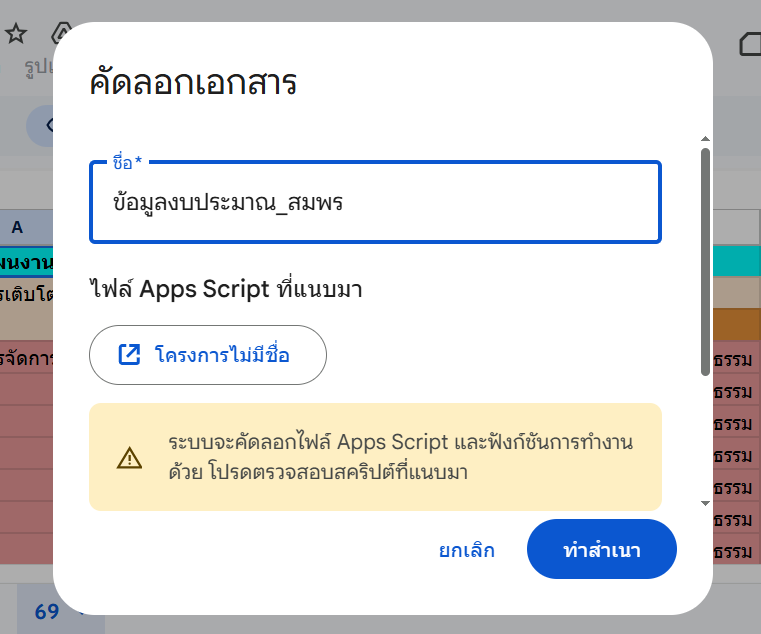
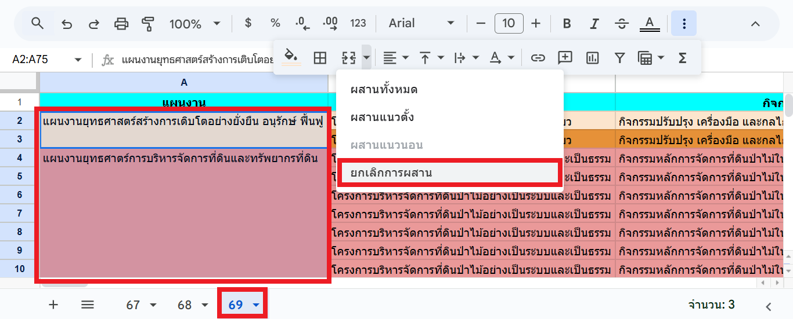
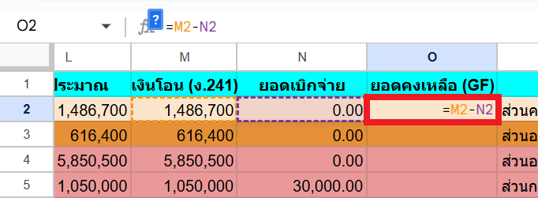

# Workshop 1: การจัดเตรียมและทำความสะอาดข้อมูล (Data Preparation & Cleaning)

## สถานการณ์จำลอง

ท่านได้รับมอบหมายให้จัดทำรายงานแผนงานและงบประมาณประจำปี 2569 ของกอง โดยหัวหน้าส่งลิงก์ Google Sheets ที่จะใช้ประกอบการสร้างรายงานมาให้ เมื่อเปิดลิงก์แล้ว ท่านพบว่าเป็นลิงก์แบบ "อ่านอย่างเดียว" จึงไม่สามารถแก้ไขข้อมูลได้ และพบว่าข้อมูลค่อนข้างพร้อมที่จะนำไปสร้างเป็นรายงานแล้ว อย่างไรก็ตาม มีจุดที่ต้องแก้ไขอยู่บ้าง ได้แก่ ข้อมูลในตารางที่มีการผสานเซลล์ มีตัวอักษรปะปนในคอลัมน์ที่อาจจะต้องใช้สำหรับการคำนวณ และยังไม่มีคอลัมน์ "ยอดคงเหลือ (GF)" ที่อาจต้องใช้ประกอบการสร้างรายงาน เพราะฉะนั้น จึงต้องจัดเตรียมและทำความสะอาดข้อมูลให้เหมาะสมกับการสร้างรายงานก่อนเป็นอันดับแรก

## วัตถุประสงค์

1. คัดลอกไฟล์ Google Sheets ต้นฉบับมาเป็นของตนเอง
2. ตรวจสอบและจัดโครงสร้างข้อมูลในตารางให้ถูกต้อง
3. ทำความสะอาดข้อมูลตัวเลขและเตรียมคอลัมน์คำนวณสำหรับใช้งานต่อ

## การทำสำเนาไฟล์ (Make a Copy)

1. เปิดลิงก์ที่ได้รับจากหัวหน้า <https://docs.google.com/spreadsheets/d/1dKeUK6-k2r0xv4-5j7PX06Ha4Faoq5qEPzwMb_6gy4Q/edit?usp=sharing>
2. ไปที่ **ไฟล์ (File) > ทำสำเนา (Make a copy)**

    

3. ตั้งชื่อไฟล์ใหม่ (เช่น `Workshop_ชื่อของท่าน`) แล้วกด **ทำสำเนา**

    { width="400" }

ผลลัพธ์: ได้ไฟล์ใหม่ใน Google Drive ของตนเองที่แก้ไขข้อมูลได้

## การยกเลิกการผสานเซลล์ (Unmerge Cells)

1. เลือกแผ่นงานที่ชื่อว่า 69 (ปีงบประมาณ พ.ศ. 2569) จะเห็นว่าข้อมูลในคอลัมน์ A (แผนงาน) มีการผสานเซลล์ จึงต้องยกเลิกการผสานเซลล์เสียก่อน
2. คลิกที่เซลล์ A1 จากนั้นเลื่อนลงไปด้านล่าง แล้วกดแป้น Shift ค้างก่อนคลิกที่บริเวณเซลล์ A75 เพื่อเลือกเซลล์ทั้งหมดที่ต้องการยกเลิกการผสานเซลล์
3. คลิกเครื่องหมาย ▼ (ลูกศรชี้ลง) ที่อยู่ทางขวาของไอคอน **ผสานเซลล์ (Merge Cells)** จากนั้นเลือกเมนู **ยกเลิกการผสาน (Unmerge Cells)** เซลล์จะถูกแยกออกจากกัน และข้อมูลชื่อแผนงานจะอยู่ที่บรรทัดแรกของแต่ละกลุ่ม

    

4. คลิกเซลล์ที่มีข้อมูล เช่น A2 จากนั้นดับเบิ้ลคลิกที่วงกลมสีน้ำเงินที่อยู่บริเวณมุมล่างขวาของเซลล์ เพื่อเติมข้อมูลลงไปในเซลล์ที่อยู่ด้านล่าง ทำเช่นนี้จนมีข้อมูลแผนงานครบ จนถึงแถวที่ A75

    { width="600" }

## การทำความสะอาดข้อมูลตัวเลข

1. ท่านพบว่าข้อมูลในคอลัมน์ L (งบประมาณ) มีตัวอักษรปะปนอยู่กับตัวเลข เช่น `50,000 บาท` แทนที่จะเป็น `50000` (มีเครื่องหมายจุลภาคคั่นตัวเลขหลักพัน และมีคำว่า " บาท" ต่อท้าย) ซึ่งไม่สามารถนำไปใช้ประกอบการคำนวณได้ จึงต้องลบตัวอักษรที่ปะปนอยู่ออกไป
2. คลิกเซลล์แรกที่ต้องการแก้ไข ในที่นี้คือเซลล์ L2 จากนั้นเลื่อนลงไปด้านล่าง แล้วกดแป้น Shift ค้างก่อนคลิกที่เซลล์ L75 เพื่อเลือกเซลล์ที่ต้องการแก้ไข

    !!! tips "เคล็ดลับ"
        สามารถกดแป่น Ctrl + Shift + ▼ แทนการกดปุ่ม Shift ค้างแล้วคลิกที่เซลล์สุดท้าย เพื่อเลือกเซลล์ที่มีข้อมูลที่อยู่ด้านล่างทั้งหมดได้

3. เลือกเมนู **แก้ไข (Edit)** จากนั้นเลือกเมนูย่อย **ค้นหาและแทนที่ (Find and Replace)** หรือกดแป่น Ctrl + H
4. ระบุข้อมูลตามรายละเอียดด้านล่าง จากนั้นกดปุ่ม **แทนที่ทั้งหมด (Replace All)**

    * ค้นหา (Find): ` บาท`
    * แทนที่ด้วย (Replace with): ` ` (ค่าว่าง)
    * ค้นหาช่วงที่เจาะจง (Search within): `'69'!L2:L75`

    { width="600" }

5. ระบุข้อมูลตามรายละเอียดด้านล่าง จากนั้นกดปุ่ม **แทนที่ทั้งหมด (Replace All)**

    * ค้นหา (Find): `,`
    * แทนที่ด้วย (Replace with): ` ` (ค่าว่าง)
    * ค้นหาช่วงที่เจาะจง (Search within): `'69'!L2:L75`

6. กดปุ่ม **เสร็จสิ้น (Done)**

## การเพิ่มคอลัมน์คำนวณ (Calculated Column)

1. คลิกขวาที่คอลัมน์ N (ยอดเบิกจ่าย) จากนั้นเลือกเมนู **แทรก 1 คอลัมน์ทางขวา (Insert 1 column to the right)** จะพบว่ามีคอลัมน์ว่างแทรกเข้ามาเป็นคอลัมน์ O

    { width="600" }

2. แถวบนสุดของคอลัมน์ O (ช่อง O1) เป็นชื่อคอลัมน์ ให้ตั้งชื่อว่า **ยอดคงเหลือ (GF)**
3. คลิกเซลล์ O2 จากนั้นพิมพ์สูตร `=M2-N2` (เงินโอน - ยอดเบิกจ่าย)

    { width="600" }

4. ดับเบิ้ลคลิกที่วงกลมสีน้ำเงินที่อยู่บริเวณมุมล่างขวาของเซลล์ O2 เพื่อเติมสูตรลงในคอลัมน์ O จนถึงรายการสุดท้าย

    { width="400" }

ขณะนี้ข้อมูลของท่านสะอาด ถูกต้อง และพร้อมสำหรับการนำไปสร้างเป็นรายงานแล้ว
