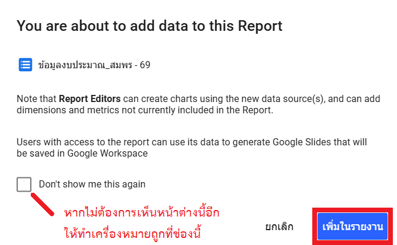

# Workshop 2: การเชื่อมต่อข้อมูล (Data Connection)

## สถานการณ์จำลอง

ผู้บริหารต้องการเห็นภาพรวมการเบิกจ่ายปีงบประมาณ พ.ศ. 2569 แบบรวดเร็ว ไม่ต้องอ่านตารางยาว ท่านจึงเชื่อมข้อมูลที่เตรียมไว้ใน Google Sheets เข้าสู่ Looker Studio เพื่อเตรียมสร้างรายงานที่สวยงามและเข้าใจง่าย

## วัตถุประสงค์

1. สร้างรายงานใหม่ใน Looker Studio
2. เชื่อมต่อข้อมูลจาก Google Sheets ที่เตรียมจาก Workshop 1
3. ตรวจสอบความถูกต้องของชนิดข้อมูล

## การสร้างรายงานใหม่ใน Looker Studio

1. เข้าสู่เว็บไซต์ [Looker Studio](https://lookerstudio.google.com/)
2. คลิกที่ปุ่ม **+ สร้าง (+ Create)** ทางด้านซ้ายบน
3. เลือกเมนู **รายงาน (Report)**

    { width="300" }

    !!! note "หมายเหตุ"
        หากเป็นการใช้งานครั้งแรก จะพบหน้าต่าง **เริ่มด้วยการสร้างบัญชีให้เสร็จ** ให้ระบุข้อมูลดังนี้:

        - **ประเทศ**: เลือก **ไทย**
        - **บริษัท**: กรอก **กรมป่าไม้**
        - คลิกทำเครื่องหมายถูกที่ช่อง **ฉันยอมรับ Looker Studio ข้อกำหนดในการให้บริการ...**
        - คลิกปุ่ม **ทำต่อ**

        { width="400" }

        จากนั้นจะพบหน้าต่าง **เลือกข่าวสารอัปเดตที่ต้องการรับ** (ขั้นตอนที่ 2 จาก 2) ให้เลือก **ไม่ใช่** ในทุกหัวข้อ (ยกเว้นหัวข้อที่ท่านต้องการรับข่าวสารทางอีเมล ให้เลือก **ใช่**) จากนั้นคลิกปุ่ม **ทำต่อ**

        { width="500" }

## การเชื่อมต่อกับ Google Sheets

เมื่อท่านสร้างรายงานใหม่ ระบบจะแสดงหน้าต่าง "เพิ่มข้อมูลลงในรายงาน (Add data to report)" โดยอัตโนมัติ

1. ในแถบ **เชื่อมต่อข้อมูล (Connect to data)**, เลือกตัวเชื่อมต่อ (Connector) ที่ชื่อว่า **Google Sheets**

    { width="600" }

    !!! note "หมายเหตุ"
        หากเป็นการใช้งานครั้งแรก ระบบจะแจ้งว่า **"Looker Studio ต้องได้รับสิทธิ์เพื่อเชื่อมต่อกับ Google ชีตของคุณ"** ให้คลิกปุ่ม **ให้สิทธิ์** (Authorize) เลือกบัญชี Google ที่ต้องการอนุญาตสิทธิ์ และดำเนินการต่อเพื่อให้ Looker Studio ได้รับสิทธิ์ในการเชื่อมต่อ Google Sheets

        { width="400" }

2. เลือก **Spreadsheet** (ไฟล์) ที่ท่านได้ทำสำเนาไว้จาก Workshop 1 (เช่น `Workshop_ชื่อของท่าน`)
3. เลือก **Worksheet** (แผ่นงาน) ที่ต้องการเชื่อมต่อ ในที่นี้ให้เลือกแผ่นงาน **69**
4. ตรวจสอบว่ามีเครื่องหมายถูกหน้า 2 ตัวเลือกนี้:
    - **ใช้แถวแรกเป็นส่วนหัว (Use first row as headers)**
    - **รวมเซลล์ที่ซ่อนและกรอง (Include hidden and filtered cells)**
5. กดปุ่ม **เพิ่ม (Add)** ที่มุมล่างขวา

    { width="800" }

6. จะมีหน้าต่างยืนยันการเพิ่มข้อมูล ให้กดปุ่ม **เพิ่มในรายงาน (Add to report)**

    { width="400" }

    !!! tip "เคล็ดลับ"
        หากท่านไม่ต้องการเห็นหน้าต่างยืนยันในทุกครั้งที่มีการเพิ่มข้อมูล ให้ทำเครื่องหมายถูกที่ช่อง **Don't show me this again**

## การตรวจสอบความถูกต้องของข้อมูล (Data Verification)

เมื่อเชื่อมต่อข้อมูลเสร็จแล้ว ให้ตรวจสอบชนิดของข้อมูล (Data Type) ในแถบ **ข้อมูล (Data)** ทางด้านขวา ว่าระบบตรวจจับชนิดของข้อมูลได้ถูกต้องหรือไม่

1. จากภาพด้านล่าง ท่านจะเห็นว่าฟิลด์ **"ปีงบประมาณ"** และ **"รหัสกิจกรรมย่อย"** ถูกตรวจจับเป็น **ตัวเลข (123)** และ **วันที่ (Date)** ตามลำดับ แต่เนื่องจากทั้งสองฟิลด์นี้เป็นตัวเลขที่ **จะไม่ถูกนำไปคำนวณ** (เช่น ไม่นำไปหาผลรวม หรือหาค่าเฉลี่ย) จึงควรเปลี่ยนชนิดข้อมูลให้เป็น **ข้อความ (Text)** แทน โดยให้นำเมาส์ไปชี้ที่หน้าชื่อแหล่งข้อมูล (ไอคอน Google Sheets จะเปลี่ยนเป็นรูป **ดินสอ**) แล้วคลิกเพื่อแก้ไขแหล่งข้อมูล

    

2. ระบบจะแสดงรายการฟิลด์ทั้งหมด ให้เปลี่ยนชนิดข้อมูลของ **"ปีงบประมาณ"** และ **"รหัสกิจกรรมย่อย"**

    - คลิกที่ Dropdown ในคอลัมน์ **ประเภท (Type)** ของฟิลด์ที่ต้องการแก้ไข
    - เลือก **ข้อความ (Text)**

    !!! warning "ระวัง"
        ให้แก้ไขชนิดข้อมูลของฟิลด์ **ปีงบประมาณ** ไม่ใช่ **งบประมาณ**

3. เมื่อแก้ไขครบแล้ว ให้กดปุ่ม **เสร็จสิ้น (Done)** ที่มุมขวาบน

    

ขณะนี้รายงานของท่านพร้อมสำหรับการสร้างกราฟและตารางแล้ว
