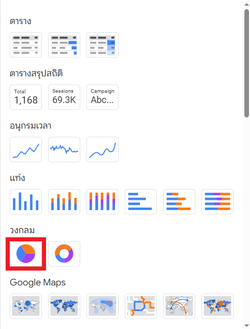
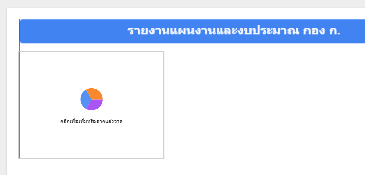
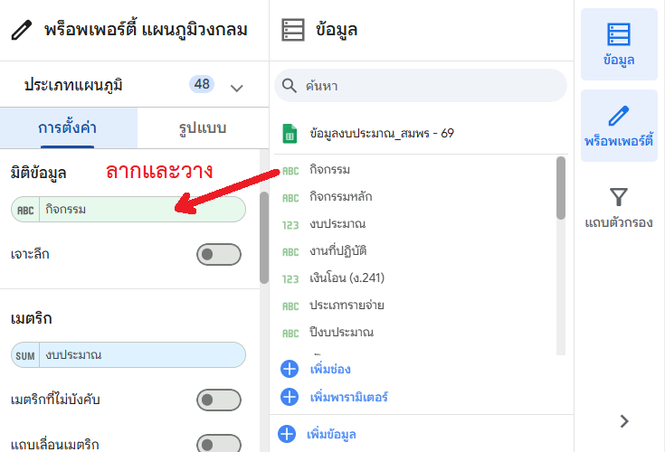
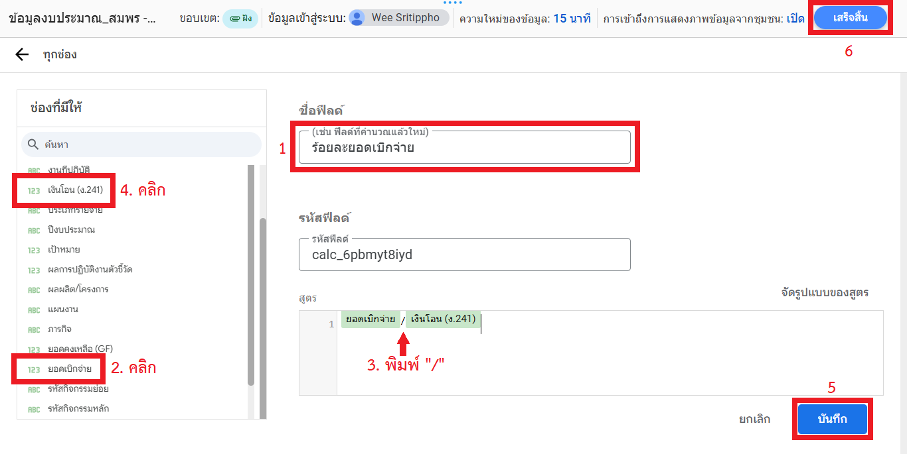
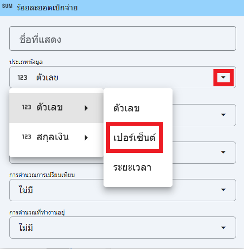
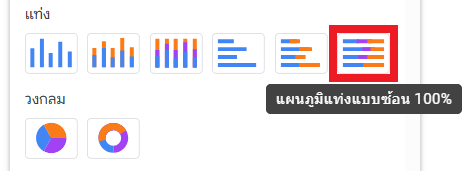

# Workshop 3: การสร้างการแสดงผล (Visualization)

## สถานการณ์จำลอง

ผู้บริหารติดตามรายงานการเบิกจ่ายปีงบประมาณ พ.ศ. 2569 ที่ได้มอบหมายให้ท่านดำเนินการ เนื่องจากจำเป็นต้องใช้รายงานดังกล่าวประกอบการประชุมในครั้งถัดไป ท่านจึงต้องเร่งจัดทำรายงานให้แล้วเสร็จโดยไว

## วัตถุประสงค์

1. ออกแบบหน้ารายงานด้วยองค์ประกอบพื้นฐาน (ชื่อรายงาน กราฟ ตาราง)
2. สร้าง Visualization หลักเพื่อช่วยตอบคำถามเรื่องแหล่งงบประมาณ การเบิกจ่าย และรายละเอียดตามหน่วยปฏิบัติ
3. สร้าง Calculated Field เพื่อคำนวณหาค่าร้อยละการเบิกจ่าย

## การตั้งชื่อรายงาน

1. ที่มุมบนซ้ายของหน้าจอ คลิกที่ข้อความ **รายงานที่ไม่มีชื่อ** (หรือ Untitled Report)
2. เปลี่ยนชื่อเป็น `รายงานแผนงานและงบประมาณ กอง ก.`

    { width="400" }

3. เพิ่มหัวข้อรายงานบนหน้ากระดาษ:
    - คลิกที่ไอคอน **ข้อความ (Text)** รูปตัว **A** บนแถบเครื่องมือด้านบน
    - ลากเมาส์วาดกรอบข้อความบริเวณส่วนบนของรายงาน
    - พิมพ์ข้อความ `รายงานแผนงานและงบประมาณ กอง ก.`
    - ปรับขนาดตัวอักษรให้ใหญ่ขึ้น (เช่น 32px) ทำตัวหนา และจัดกึ่งกลางที่แถบ **พร็อพเพอร์ตี้ ข้อความ (Text Properties)** ด้านขวา

    { width="800" }

    !!! example "ลองทำด้วยตนเอง"
        ลองเปลี่ยนสีของข้อความให้เป็น **สีขาว** และเปลี่ยนสีของพื้นหลังให้เป็น **จานสีของแผนภูมิ 1** 

## กราฟสัดส่วนแหล่งงบประมาณ (Pie Chart)

**คำถามที่ตอบ:** งบประมาณปีนี้จัดสรรให้ส่วนกลางหรือภูมิภาคมากกว่ากัน?

1. คลิกเมนู **เพิ่มแผนภูมิ (Add a chart)** บนแถบเครื่องมือ

    { width="600" }

2. เลือก **แผนภูมิวงกลม (Pie chart)**

    { width="400" }

3. คลิกวางแผนภูมิลงบนพื้นที่ว่าง

    { width="600" }

4. ตั้งค่าข้อมูลในแถบ **การตั้งค่า (Setup)** ด้านขวา:
    - หากแท็บข้อมูลไม่แสดง ให้คลิกปุ่ม **ข้อมูล (Data)**
    - พิมพ์ค้นหาด้วยคำว่า `งบประมาณ`
    - **มิติข้อมูล (Dimension):** ลากฟิลด์ `แหล่งงบประมาณ` มาใส่
    - **เมตริก (Metric):** ลากฟิลด์ `งบประมาณ` มาใส่

    { width="600" }

## กราฟสัดส่วนงบประมาณตามกิจกรรม (Pie Chart)

**คำถามที่ตอบ:** กิจกรรมไหนได้รับการจัดสรรงบประมาณมากที่สุด?

1. สร้างแผนภูมิวงกลม (Pie chart) ขึ้นมาใหม่ หรือใช้วิธี **คัดลอก (Copy)** แผนภูมิเดิมที่ทำไว้แล้ว

    { width="400" }

2. ในแถบ **การตั้งค่า (Setup)** ให้เปลี่ยน **มิติข้อมูล (Dimension)**:
    - ลากฟิลด์ `กิจกรรม` มาวางทับ `แหล่งงบประมาณ` เดิม
    - (ส่วน **เมตริก** ให้คงไว้เป็น `งบประมาณ` เช่นเดิม)

    { width="600" }

หากท่านทำตาม Workshop จนมาถึงขั้นตอนนี้ ท่านจะเห็นหน้ารายงานที่มีลักษณะใกล้เคียงกับภาพด้านล่าง

{ width="600" }

!!! example "ลองทำด้วยตนเอง"
    ลองปรับแต่งกราฟ **สัดส่วนงบประมาณ** โดยย้าย **ตำแหน่ง (Position)** ของ **คำอธิบาย (Description)** มาไว้ **ด้านล่างสุด (Bottom)** ในแถบย่อย **รูปแบบ (Style)**

## สถานะการเบิกจ่ายภาพรวม (Gauge)

**คำถามที่ตอบ:** เบิกจ่ายไปแล้วร้อยละเท่าใด?

### ขั้นตอนที่ 1: สร้างฟิลด์คำนวณ (Calculated Field)
เนื่องจากในข้อมูลต้นฉบับไม่มีคอลัมน์ "ร้อยละยอดเบิกจ่าย" เราจึงต้องสร้างขึ้นเอง

1. ที่แถบ **ข้อมูล (Data)** ด้านขวาล่าง คลิกปุ่ม **+ เพิ่มช่อง (Add a field)** จากนั้นเลือก **เพิ่มฟิลด์ที่คำนวณแล้ว (Add a calculated field)**

    { width="400" }

2. ตั้งชื่อฟิลด์ (Field Name) ว่า `ร้อยละยอดเบิกจ่าย`
3. ในช่องสูตร (Formula) พิมพ์สูตรดังนี้: `ยอดเบิกจ่าย/เงินโอน (ง.241)`
    *(ให้คลิกเลือกฟิลด์จากรายการเพื่อให้แน่ใจว่าชื่อฟิลด์ถูกต้อง)*
4. กด **บันทึก (Save)** และ **เสร็จสิ้น (Done)**

    { width="600" }

### ขั้นตอนที่ 2: สร้างแผนภูมิเกจ (Gauge Chart)
1. คลิกเมนู **เพิ่มแผนภูมิ (Add a chart)**
2. เลือก **มาตรวัด (Gauge)**

    { width="400" }

3. วางแผนภูมิลงบนพื้นที่ว่าง

    { width="600" }

4. ตั้งค่าข้อมูลในแถบ **ตั้งค่า (Setup) > เมตริก (Metric):** ลากฟิลด์ `ร้อยละยอดเบิกจ่าย` ที่เพิ่งสร้างขึ้น ไปวางทับ `งบประมาณ` (หรือฟิลด์ใด ๆ ก็ตามที่ระบบเลือกให้โดยอัตโนมัติ)

5. คลิกที่รูปดินสอหน้าชื่อเมตริก `ร้อยละยอดเบิกจ่าย` เพื่อเปลี่ยนหน่วย

    { width="800" }

6. ที่หัวข้อ **ประเภทข้อมูล (Data type)** เลือก **ตัวเลข (Numeric) > เปอร์เซ็นต์ (Percent)**

    { width="400" }

7. เปิดตัวเลือก **แสดงแกน (Show axis)** ในแถบย่อย **รูปแบบ (Style)** จากนั้นตั้ง **ค่าต่ำสุดของแกน (Minimum value)** และ **ค่าสูงสุดของแกน (Maximum value)** เป็น `0` และ `1` ตามลำดับ

    { width="200" }

!!! example "ลองทำด้วยตนเอง"
    ลองปรับขนาดของกราฟในแผ่นงาน เพื่อย้ายกราฟมาตรวัดให้ไปอยู่แถวเดียวกับกราฟวงกลมทั้ง 2 กราฟ

## การเบิกจ่ายจำแนกตามกลุ่ม (Stacked Bar)

เราจะสร้างกราฟแท่งเพื่อเปรียบเทียบยอดเบิกจ่ายและงบประมาณคงเหลือในมิติต่าง ๆ ดังนี้

### กราฟแท่งที่ 1: จำแนกตามแหล่งงบประมาณ
1. เพิ่มแผนภูมิ **แผนภูมิแท่งแบบซ้อน 100% (Stacked 100% column chart)**

    { width="300" }

2. **มิติข้อมูล (Dimension):** `แหล่งงบประมาณ`
3. **เมตริก (Metric):** ลากฟิลด์ `ยอดเบิกจ่าย` และ `งบประมาณคงเหลือ (GF)` มาใส่ (ใส่ทั้ง 2 ฟิลด์)

    { width="300" }

4. ไปที่แถบ **รูปแบบ (Style)** หัวข้อ **ลงสีตาม (Color by)** ให้เลือกสีในช่องที่ 2 แล้วเปลี่ยนให้เป็นสีเทา (ให้สีของงบประมาณคงเหลือเป็นสีเทา)

    { width="250" }

### กราฟแท่งที่ 2: จำแนกตามชื่อกิจกรรม

ใช้วิธีการ **ทำซ้ำ (Duplicate)** กราฟแท่งที่ 1 แล้วเปลี่ยน **มิติข้อมูล (Dimension)** เป็น: `กิจกรรม`

{ width="300" }

### กราฟแท่งที่ 3: จำแนกตามชื่อหน่วยปฏิบัติ

ใช้วิธีการ **ทำซ้ำ (Duplicate)** กราฟแท่งที่ 2 แล้วเปลี่ยน

- **ประเภทแผนภูมิ (Chart type)** เป็น: **แผนภูมิแท่งแนวตั้งแบบซ้อน 100% (Stacked 100% vertical column chart)**

    { width="300" }

- **มิติข้อมูล (Dimension)** เป็น: `หน่วยปฏิบัติ`

    { width="300" }

หากท่านทำตาม Workshop จนมาถึงขั้นตอนนี้ ท่านจะเห็นหน้ารายงานที่มีลักษณะใกล้เคียงกับภาพด้านล่าง

{ width="600" }

## บทสรุป

ใน Workshop นี้ ท่านได้เรียนรู้วิธีการสร้าง Visualization พื้นฐานและการสร้าง Calculated Field ซึ่งเป็นหัวใจสำคัญของการทำรายงานใน Looker Studio
