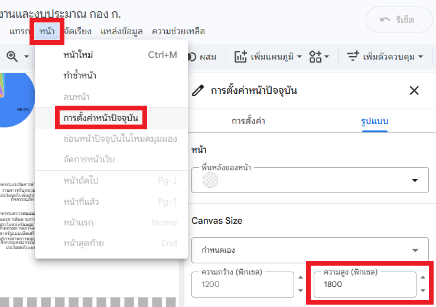
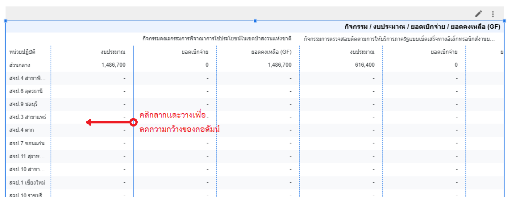

# Workshop 4: การสร้างตารางสรุป (Pivot Table)

## สถานการณ์จำลอง

ผู้บังคับบัญชาพึงพอใจกับรายงานที่ท่านสร้างขึ้น แต่ต้องการเห็นรายละเอียดข้อมูลเพิ่มเติมด้วย นอกจากนี้ยังต้องการลิงก์ของรายงานที่สามารถส่งให้ผู้อื่นได้โดยที่ไม่ต้องมีบัญชี Google หรือเข้าสู่ระบบด้วย ท่านจึงตัดสินใจที่จะเพิ่มตารางสรุปรายละเอียด และแชร์ลิงก์รายงานแบบสาธารณะ

## วัตถุประสงค์

1. สร้างตารางสรุปรายละเอียด (Pivot Table) เพื่อดูข้อมูลในมิติที่หลากหลาย
2. แชร์รายงานให้กับผู้อื่นเข้าดูได้

## การปรับขนาดพื้นที่รายงาน (Canvas Size)

เนื่องจากท่านจำเป็นต้องวางตารางข้อมูลเพิ่มเติม แต่พื้นที่ด้านล่างของรายงานอาจไม่เพียงพอ จึงต้องปรับเพิ่มความสูงของรายงานก่อนที่จะดำเนินการต่อ

1. คลิกที่เมนู **หน้า (Page)** แถบด้านบน
2. เลือก **การตั้งค่าหน้าปัจจุบัน (Current page settings)**
3. ที่หน้าต่างด้านขวา เลือกแถบ **รูปแบบ (Style)**
4. ที่หัวข้อ **Canvas Size** ปรับค่า **ความสูง (Height)** เป็น `1800`

{ width="600" }

## ตารางสรุปรายละเอียด (Pivot Table)

เพื่อดูรายละเอียดตัวเลขรายหน่วยงานและกิจกรรม

1. เพิ่มแผนภูมิ **Pivot table**

    { width="600" }

2. **มิติข้อมูลแถว (Row Dimension):** `หน่วยปฏิบัติ`
3. **มิติข้อมูลคอลัมน์ (Column Dimension):** `กิจกรรม`
4. **เมตริก (Metric):** `งบประมาณ`, `ยอดเบิกจ่าย`, `ยอดคงเหลือ (GF)`

    { width="300" }

5. ปรับความกว้างของคอลัมน์ให้เหมาะสม โดยการคลิกที่เส้นแบ่งระหว่างคอลัมน์แล้วลาก

    

6. ที่แถบ **รูปแบบ (Style)** ให้เปิดการแสดงผลรวม
    - **แถว (Rows):** เลือก **แสดงผลรวมทั้งหมด (Show grand totals)**
    - **คอลัมน์ (Columns):** เลือก **แสดงผลรวมทั้งหมด (Show grand totals)**

    { width="300" }

## การแชร์รายงาน (Sharing)

เมื่อสร้างรายงานเสร็จสมบูรณ์แล้ว ท่านสามารถแชร์รายงานให้ผู้อื่นเข้าดูได้

1. คลิกปุ่ม **แชร์ (Share)** ที่มุมขวาบน

    { width="300" }

2. ที่หัวข้อ **การตั้งค่าลิงก์ (Link settings)** ให้เปลี่ยนจาก **จำกัด (Restricted)** เป็น **ไม่เป็นสาธารณะ (Unlisted)** หรือ **สาธารณะ (Public)**
    - **ไม่เป็นสาธารณะ (Unlisted):** ผู้ที่มีลิงก์เท่านั้นจึงจะดูได้ (แนะนำ)
    - **สาธารณะ (Public):** ใครก็ได้บนอินเทอร์เน็ตสามารถค้นหาและดูได้

    { width="500" }

3. คลิก **คัดลอกลิงก์ (Copy link)** เพื่อคัดลอกลิงก์เข้าสู่คลิปบอร์ด และคลิก **บันทึก (Save)** เพื่อบันทึกการตั้งค่า
4. ท่านสามารถส่งต่อลิงก์ให้ผู้อื่นได้ทันที

## บทสรุป

ใน Workshop นี้ ท่านได้เรียนรู้วิธีการขยายพื้นที่รายงานเพื่อรองรับข้อมูลที่มากขึ้น การสร้าง Pivot Table เพื่อดูรายละเอียดข้อมูลในมิติที่หลากหลาย และการแชร์รายงานเพื่อให้ผู้ที่เกี่ยวข้องสามารถเข้าถึงข้อมูลได้โดยสะดวก
