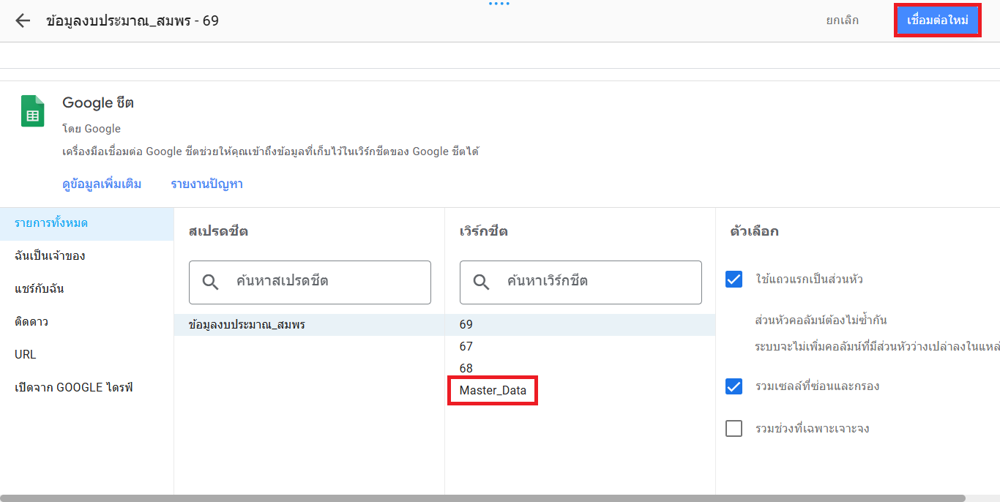
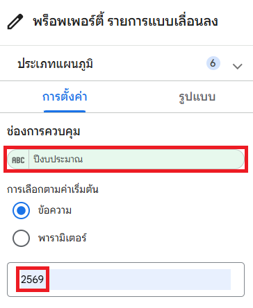

# Workshop เสริมที่ 1: การทำให้เลือกดูข้อมูลตามปีงบประมาณได้

## สถานการณ์จำลอง

เมื่อเริ่มต้นงบประมาณใหม่ ท่านพบว่าต้องสร้างรายงานใน Looker Studio ที่มีหน้าตาแบบเดิมซ้ำอีกครั้ง เพียงแต่เปลี่ยนข้อมูลให้เป็นของปีงบประมาณใหม่ จึงสงสัยว่ามีวิธีสร้างรายงานเพียงครั้งเดียว แต่ใช้ได้ตลอดโดยที่ไม่ต้องสร้างไฟล์ใหม่ทุกปีหรือไม่

## วัตถุประสงค์

1. รวมข้อมูลหลายปีงบประมาณให้อยู่ในตารางเดียว (Master Data)
2. สร้างโครงสร้างข้อมูลที่รองรับปีงบประมาณใหม่ในอนาคต
3. เปลี่ยนแหล่งข้อมูลรายงานให้ชี้ไปที่แผ่นงาน **Master_Data**
4. เพิ่มตัวกรองปีงบประมาณเพื่อให้ผู้ใช้เลือกดูข้อมูลตามปีที่ต้องการ

## การสร้างแผ่นงาน Master_Data

เราจะสร้างแผ่นงานใหม่เพื่อรวบรวมข้อมูลทุกปีไว้ด้วยกัน

1. กลับไปที่ไฟล์ Google Sheets ของท่าน
2. กดเครื่องหมาย **+** ที่มุมล่างซ้ายเพื่อสร้างแผ่นงานใหม่
3. ดับเบิ้ลคลิกที่ชื่อแผ่นงานแล้วเปลี่ยนชื่อเป็น **Master_Data**

    { width="400" }

4. คัดลอกหัวตาราง (Header) ทั้งหมดจากแผ่นงานปี 69 มาวางที่เซลล์ **A1** ของแผ่นงาน Master_Data

    { width="400" }

## การรวมข้อมูลทุกปีเข้าด้วยกัน

นำข้อมูลจากแต่ละปีมาต่อกันในแนวตั้ง (Append)

### ข้อมูลปี 2569
1. ไปที่แผ่นงาน **69**
2. คัดลอกข้อมูลทั้งหมด **ยกเว้นหัวตาราง** (เริ่มตั้งแต่แถวที่ 2 ลงไป)
3. กลับมาที่แผ่นงาน **Master_Data**
4. วางข้อมูลที่เซลล์ **A2**

### ข้อมูลปี 2568
1. ไปที่แผ่นงาน **68**
2. คัดลอกข้อมูลทั้งหมด **ยกเว้นหัวตาราง** (เริ่มตั้งแต่แถวที่ 2 ลงไป)
3. กลับมาที่แผ่นงาน **Master_Data**
4. วางข้อมูลที่เซลล์ **A76** (ต่อจากแถวสุดท้ายของข้อมูลปี 2569)

### ข้อมูลปี 2567

เนื่องจากข้อมูลปี 2567 ไม่มีคอลัมน์ `หมายเหตุ` จึงต้องคัดลอกข้อมูลจนถึงแค่คอลัมน์ U (ผลการปฏิบัติงานตัวชี้วัด)

1. ไปที่แผ่นงาน **67**
2. คัดลอกข้อมูลทั้งหมด **ยกเว้นหัวตาราง** (เริ่มตั้งแต่แถวที่ 2 ลงไป)
3. กลับมาที่แผ่นงาน **Master_Data**
4. วางข้อมูลที่เซลล์ **A150** (ต่อจากแถวสุดท้ายของข้อมูลปี 2568)

**ผลลัพธ์:** ท่านจะมีตารางข้อมูลขนาดใหญ่ที่รวมข้อมูลทุกปีไว้ในแผ่นงานเดียว

{ width="400" }

## การ Reconnect แหล่งข้อมูลไปที่ Master_Data

เปลี่ยนให้ Looker Studio ไปดึงข้อมูลจากแผ่นงาน **Master_Data** แทนแผ่นงาน **69**

1. กลับไปที่ Looker Studio ในโหมดแก้ไข (Edit)
2. ไปที่เมนู **แหล่งข้อมูล (Data source) > จัดการแหล่งข้อมูลที่เพิ่ม (Manage added data sources)**

    { width="400" }

3. คลิก **แก้ไข (Edit)** ที่แหล่งข้อมูลเดิมของท่าน

    { width="400" }

4. คลิก **แก้ไขการเชื่อมต่อ (Edit connection)** ที่มุมซ้ายบน

    { width="400" }

5. เลือกแผ่นงาน **Master_Data**
6. กด **เชื่อมต่อใหม่ (Reconnect)**

    { width="800" }

7. ระบบอาจแจ้งเตือนการเปลี่ยนแปลงฟิลด์ ให้กด **ใช้ (Apply)**

    { width="600" }

8. กด **เสร็จสิ้น (Done)** และ **ปิด (Close)**

    { width="400" }

    { width="400" }

## การเพิ่มตัวกรองปีงบประมาณ

เพื่อให้ผู้ใช้งานเลือกดูข้อมูลเฉพาะปีที่ต้องการได้

1. คลิกเมนู **เพิ่มตัวควบคุม (Add a control)**
2. เลือก **รายการแบบเลื่อนลง (Drop-down list)**

    { width="400" }

3. วางตัวกรองไว้ที่ส่วนหัวของรายงาน (ข้างๆ ชื่อรายงาน)

    { width="300" }

4. ตั้งค่าในแถบย่อย **ตั้งค่า (Setup)**:
    - **ช่องการควบคุม (Control):** เลือก `ปีงบประมาณ`
    - **การเลือกตามค่าเริ่มต้น (Default value):** เลือก `ข้อความ` และกรอก `2569`

    { width="300" }

5. ตั้งค่าในแถบย่อย **รูปแบบ (Format)**:
    - **เลือกรายการเดียว (Single selection):** เปิด
    - **อนุญาต "เลือกทั้งหมด (Allow select all)":** ปิด
    - **เปิดใช้ช่องค้นหา (Search box):** ปิด

    { width="300" }

6. ทดสอบการใช้งานโดยกดปุ่ม **ดู (View)** ที่มุมขวาบน แล้วลองเปลี่ยนปีใน Drop-down กราฟทั้งหมดควรอัปเดตตามปีที่เลือก

    { width="800" }

## บทสรุป

ในส่วนนี้ เราได้เรียนรู้วิธีการรวมข้อมูลจากหลายปีเข้าด้วยกันในแผ่นงาน Master_Data และเชื่อมต่อ Looker Studio ไปยังแหล่งข้อมูลใหม่นี้ นอกจากนี้ เรายังได้เพิ่มตัวกรองปีงบประมาณเพื่อให้รายงานมีความยืดหยุ่นและใช้งานง่ายขึ้นสำหรับผู้ใช้

