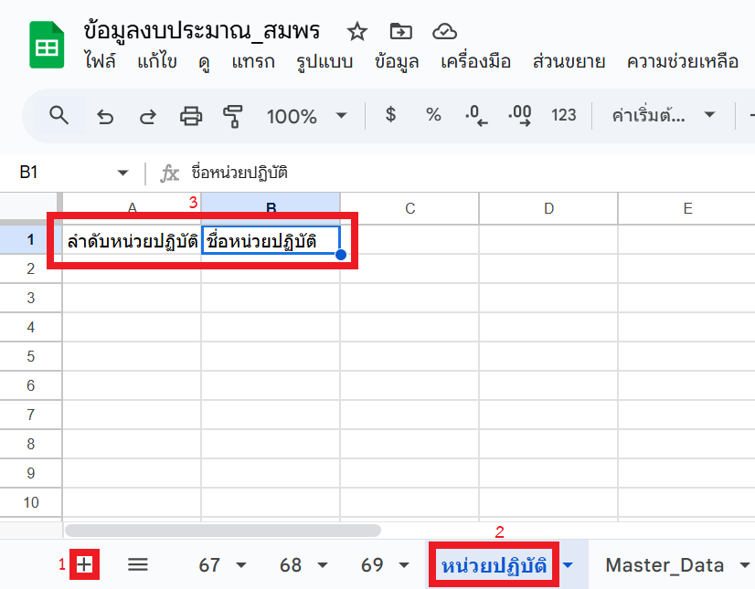
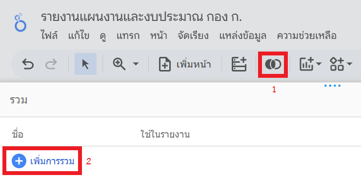
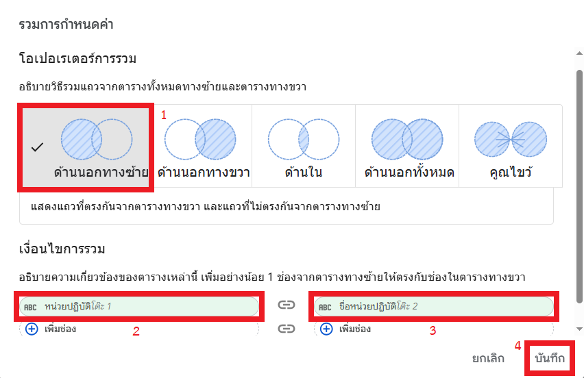
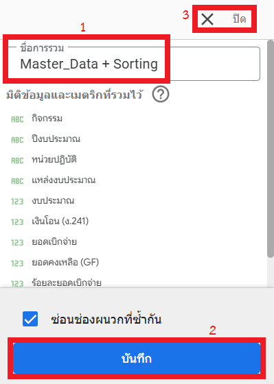

# Workshop เสริมที่ 2: การเรียงลำดับข้อมูลในรายงาน (Custom Sorting)

## สถานการณ์จำลอง

ท่านได้รับ Feedback จากหัวหน้าว่าอยากเรียงลำดับหน่วยปฏิบัติตามโครงสร้างหน่วยงาน คือ ส่วนกลาง, สจป. 1-13, สจป. สาขาทุกสาขา แทนที่จะเรียงตามตัวอักษร ก-ฮ ซึ่งไม่เป็นระเบียบและทำให้รายงานอ่านยาก

## วัตถุประสงค์

1. สร้างตารางอ้างอิงลำดับหน่วยงาน
2. เรียนรู้เทคนิคการผสมข้อมูล (Data Blending) เพื่อนำลำดับมาใช้กับข้อมูลหลัก
3. จัดเรียงกราฟตามลำดับที่กำหนดเอง

## สร้างแผ่นงานอ้างอิง

สร้างตารางอ้างอิงให้ Looker Studio รู้ว่าหน่วยงานไหนควรอยู่อันดับที่เท่าไหร่

1. สร้างแผ่นงานใหม่ใน Google Sheets ไฟล์เดิม ตั้งชื่อว่า **หน่วยปฏิบัติ**

    { width="600" }

2. สร้างคอลัมน์ 2 คอลัมน์:
    - **A1:** `ลำดับหน่วยปฏิบัติ` (สำหรับใส่ตัวเลขเรียงลำดับ)
    - **B1:** `ชื่อหน่วยปฏิบัติ` (สำหรับใส่ชื่อหน่วยงาน)
3. กรอกข้อมูลลงไป:
    - **ชื่อหน่วยปฏิบัติ:** คัดลอกข้อมูลตั้งแต่เซลล์ `R4` จนไปถึงเซลล์ `R27` ของแผ่นงาน **69** มาวาง
    - **ลำดับหน่วยปฏิบัติ:** ใส่ตัวเลข 1, 2, 3, ..., 24 ไล่ลงไป

    !!! tip "เคล็ดลับ"
        สามารถพิมพ์เฉพาะลำดับ 1 และ 2 จากนั้นเลือกเซลล์ที่มีตัวเลขทั้ง 2 และดับเบิลคลิกจุดจับเติม (fill handle) เพื่อเติมลำดับตัวเลขจนถึงแถวสุดท้ายโดยอัตโนมัติได้

        { width="300" }

    !!! warning "ข้อควรระวัง"
        ข้อมูลในคอลัมน์ **ชื่อหน่วยปฏิบัติ** จะต้องเขียนให้ **ตรงกันทุกตัวอักษร** กับข้อมูลในแผ่นงาน Master_Data มิฉะนั้นจะไม่สามารถเชื่อมโยงข้อมูลทั้ง 2 แผ่นงานได้ (แนะนำให้ใช้วิธี Copy-Paste ชื่อหน่วยงานมาวาง)

## การผสมข้อมูล (Data Blending) ใน Looker Studio

นำตาราง "หน่วยปฏิบัติ" มาเชื่อมกับ "Master_Data" เพื่อดึงเลขลำดับมาใช้

1. กลับไปที่ Looker Studio
2. คลิกไอคอน **เพิ่มข้อมูล (Add data)** จากนั้นคลิกที่ตัวเชื่อมต่อข้อมูล ***Google Sheets**

    { width="600" }

3. เลือกแผ่นงาน "หน่วยปฏิบัติ" และกด **เพิ่ม (Add)** หากพบข้อความยืนยัน ให้กด **เพิ่มในรายงาน (Add to report)**

    { width="600" }

4. คลิก **ผสม (Blend)** จากนั้นคลิก **เพิ่มการรวม (Add a blend)**

    { width="400" }

5. ตั้งค่าการผสมข้อมูล:
    - เลือกแหล่งข้อมูลเป็นแผ่นงาน `Master_Data`
    - ในมิติข้อมูล ให้เพิ่ม กิจกรรม, ปีงบประมาณ, หน่วยปฏิบัติ, และ แหล่งงบประมาณ
    - ในเมตริก ให้เพิ่ม งบประมาณ, เงินโอน (ง.241), ยอดเบิกจ่าย, ยอดคงเหลือ (GF), และร้อยละยอดเบิก
    - จากนั้นกดปุ่ม "รวมอีกตาราง"

    { width="600" }

6. ตั้งค่าตารางที่ 2:
    - เลือกแหล่งข้อมูลเป็น `หน่วยปฏิบัติ`
    - ในมิติข้อมูล ให้เพิ่ม `ชื่อหน่วยปฏิบัติ` และ `ลำดับหน่วยปฏิบัติ`

    { width="500" }

7. กำหนดเงื่อนไขการเชื่อม (Join configuration):
    - คลิกที่กล่อง **กำหนดค่าการผนวก (Join configuration)** ตรงกลางระหว่างสองตาราง
    - **โอเปอเรเตอร์การรวม (Join operator):** เลือก **ด้านนอกทางซ้าย (Left Outer)**
    - **เงื่อนไขการเชื่อม (Join conditions):**
        - ด้านซ้าย (Master_Data) เลือก `หน่วยปฏิบัติ`
        - ด้านขวา (หน่วยปฏิบัติ) เลือก `ชื่อหน่วยปฏิบัติ`
    - กด **บันทึก (Save)**

    { width="800" }

    { width="800" }

8. ตั้งชื่อการผสมข้อมูล (Data Blend Name) ด้านขวาบนว่า `Master_Data + Sorting`

    { width="300" }

9. กด **บันทึก (Save)** และ **ปิด (Close)**

## การจัดเรียงข้อมูลในแผนภูมิ

เมื่อผสมข้อมูลเสร็จแล้ว เราจะนำฟิลด์ "ลำดับหน่วยปฏิบัติ" มาใช้ในการจัดเรียง

1. เลือกแผนภูมิทั้งหมด โดยการกดแป้น Shift + คลิกที่ส่วนหัวของแผนภูมิ ทำเช่นนี้จนครบทุกแผนภูมิ

    { width="800" }

2. ที่แถบ **ตั้งค่า (Setup)** เปลี่ยน **แหล่งข้อมูล (Data source)** เป็น `Master_Data + Sorting` (ที่เราเพิ่งสร้าง)
3. เลือกแผนภูมิที่ต้องการจัดเรียง แล้วเลื่อนลงมาที่หัวข้อ **จัดเรียง (Sort)**

    { width="800" }

4. คลิกที่ฟิลด์เดิม แล้วเปลี่ยนเป็นเลือกฟิลด์ `ลำดับหน่วยปฏิบัติ`
5. เลือกการเรียงลำดับเป็น **จากน้อยไปมาก (Ascending)**

**ผลลัพธ์:** กราฟของท่านจะเรียงลำดับหน่วยงานตามที่ท่านกำหนดไว้ใน Google Sheets อย่างถูกต้อง

!!! info "เรื่องน่ารู้"
    การผสมข้อมูล (Data Blending) มักใช้ในกรณีที่เราต้องการรวมข้อมูลจากแหล่งที่เราไม่สามารถแก้ไขต้นทางได้ (เช่น ข้อมูลจากระบบอื่น หรือไฟล์ CSV ที่ส่งมา) แต่หากข้อมูลต้นทางเป็น Google Sheets ที่เราจัดการเองได้ การสร้างคอลัมน์ใหม่แล้วใช้ฟังก์ชัน XLOOKUP ใน Google Sheets เพื่อรวมข้อมูลก่อนนำเข้า Looker Studio (หรือเข้าไปที่แหล่งข้อมูลและกด **เชื่อมต่อใหม่ (Reconnect)** ในกรณีที่นำเข้าแล้ว) อาจจะจัดการได้ง่ายและมีประสิทธิภาพมากกว่า

    { width="800" }

## การแก้ไขปัญหา (Troubleshooting)

- **กราฟแสดงข้อมูลไม่ครบ:** อาจเกิดจากชื่อหน่วยงานใน 2 ตารางเขียนไม่ตรงกัน (เช่น มีเว้นวรรคเกิน) ให้กลับไปตรวจสอบใน Google Sheets
- **หาฟิลด์ลำดับไม่เจอ:** ให้กลับไปที่เมนูจัดการข้อมูลรวม (Manage blends) แล้วตรวจสอบว่าได้ลากฟิลด์ `ลำดับหน่วยปฏิบัติ` เข้ามาในส่วน Dimensions แล้วหรือยัง
