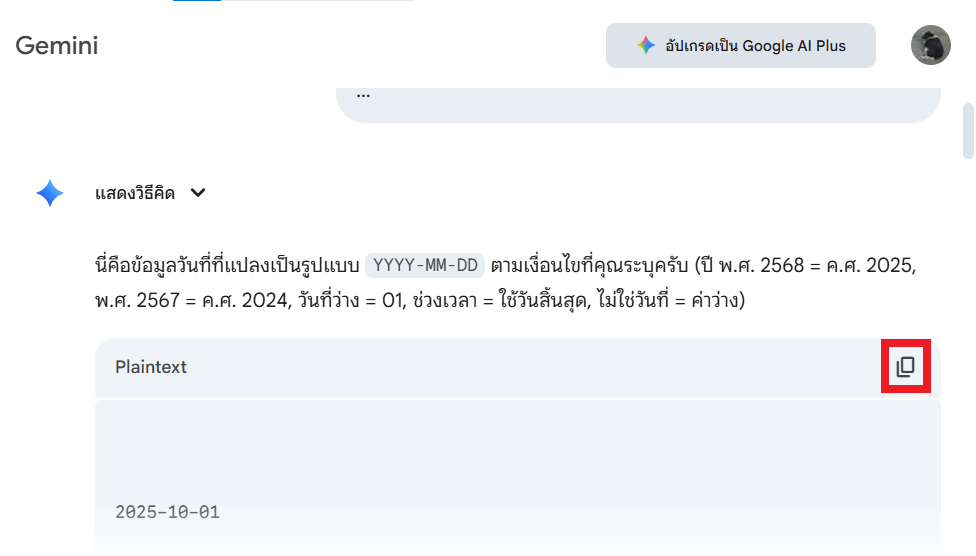
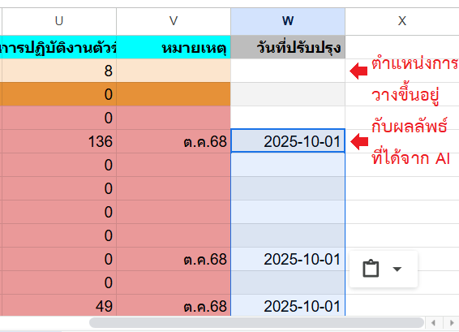
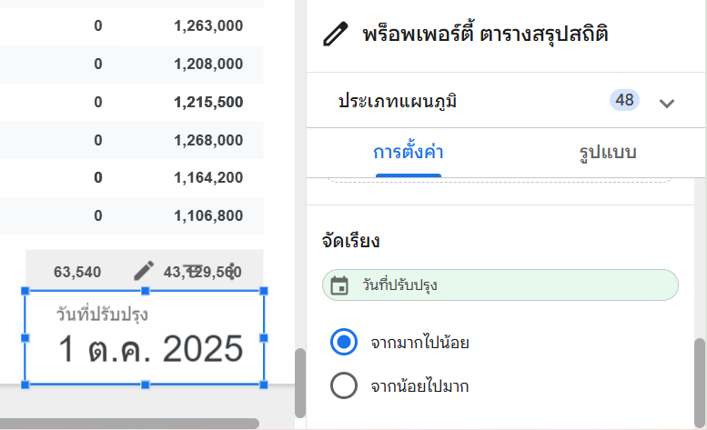

# Workshop เสริมที่ 3: การแสดงวันที่ปรับปรุงล่าสุด

## สถานการณ์จำลอง

ผู้บริหารต้องการทราบว่าข้อมูลที่เห็นเป็นข้อมูลล่าสุดเมื่อใด เพื่อความมั่นใจในการนำไปใช้งาน แต่ข้อมูลวันที่มักจะปนอยู่ในช่องหมายเหตุในรูปแบบข้อความ ทำให้ไม่สามารถนำมาแสดงผลเป็นวันที่มาตรฐานได้

## วัตถุประสงค์

1. ใช้ AI ช่วยแปลงข้อมูลวันที่จากข้อความให้เป็นรูปแบบมาตรฐาน
2. นำข้อมูลวันที่ที่ได้เข้ามาใน Looker Studio
3. แสดงวันที่ปรับปรุงล่าสุดบนรายงานด้วย Scorecard

## การเตรียมข้อมูล (Data Preparation)

เนื่องจากข้อมูลวันที่อาจจะปนอยู่ในคอลัมน์ "หมายเหตุ" หรือคอลัมน์อื่นๆ ในรูปแบบข้อความ เราจะใช้ AI เข้ามาช่วยแปลงข้อมูลให้เป็นรูปแบบวันที่มาตรฐาน (YYYY-MM-DD)

1. ไปที่ Google Sheets ที่เป็นแหล่งข้อมูลของท่าน
2. เลือกข้อมูลในคอลัมน์ **หมายเหตุ** (หรือคอลัมน์ที่มีวันที่ปนอยู่) โดยเลือกข้อมูลทั้งหมดที่ต้องการแปลง (ในตัวอย่างคือ 221 แถว)

    { width="800" }

3. กดแป้น **Ctrl + C** เพื่อคัดลอกข้อมูล
4. เข้าสู่เว็บไซต์ [Gemini](https://gemini.google.com/) เลือกโมเดลเป็น **การคิด** และใช้ Prompt ดังนี้:

        แปลงวันที่ด้านล่างให้อยู่ในรูปแบบ YYYY-MM-DD โดยคงบรรทัดให้เหมือนเดิม หากบรรทัดไหนไม่มีวัน ให้ใช้วันที่ 1 หากบรรทัดไหนเป็นช่วงเวลา เริ่มต้น-สิ้นสุด ให้ใช้เวลาสิ้นสุด

        ```
        (วางข้อมูลจากคอลัมน์หมายเหตุ)
        ```

    { width="600" }

5. เมื่อได้ผลลัพธ์แล้ว ให้คัดลอกผลลัพธ์และนำไปสร้างคอลัมน์ใหม่ใน Google Sheets (หรือแหล่งข้อมูลของท่าน) ตั้งชื่อว่า `วันที่ปรับปรุง` (หรือชื่อที่สื่อความหมาย)

    { width="600" }

    { width="400" }

!!! warning "ระวัง"
    กรณีเป็นข้อมูลที่มีชั้นความลับ หรือเป็นข้อมูลส่วนบุคคล ให้ดำเนินการตามข้อกำหนดขององค์กรของท่าน เช่น กรองส่วนที่เป็นความลับออก ประมวลผลข้อมูลส่วนบุคคลให้ไม่สามารถระบุตัวตนได้

!!! warning "ระวัง"
    ผลลัพธ์ที่ได้จาก AI อาจจะไม่ถูกต้อง ดังนั้นจึงต้องตรวจสอบข้อมูลที่ได้ก่อนนำไปใช้งาน**ทุกครั้ง**

## การเชื่อมต่อข้อมูลใหม่ (Reconnect Data Source)

เมื่อมีการเพิ่มคอลัมน์ใหม่ใน Google Sheets เราจำเป็นต้องรีเฟรชแหล่งข้อมูลใน Looker Studio

1. กลับไปที่ Looker Studio
2. ไปที่เมนู **แหล่งข้อมูล (Data Source)** > **จัดการแหล่งข้อมูลที่เพิ่ม (Manage added data sources)**

    { width="300" }

3. คลิก **Edit (แก้ไข)** ที่แหล่งข้อมูลของท่าน

    { width="600" }

4. คลิกปุ่ม **รีเฟรชช่อง (Refresh Fields)** ที่มุมล่างซ้าย

    { width="600" }

5. ตรวจสอบว่ามีฟิลด์ใหม่ที่ชื่อ `วันที่ปรับปรุง` เพิ่มเข้ามา และชนิดข้อมูลเป็น **Date (วันที่)**
6. คลิก **เสร็จสิ้น (Done)**

## การเพิ่มฟิลด์วันที่ลงใน Data Blend

เพิ่มฟิลด์วันที่ปรับปรุงลงใน Data Blend เพื่อให้นำไปแสดงผลได้

1. ไปที่เมนู **แหล่งข้อมูล (Data Source)** > **จัดการข้อมูลรวม (Manage blended data)**
2. คลิก **แก้ไข (Edit)** ท้ายรายการ `Master_Data + Sorting`
3. ในตาราง 1 ให้เพิ่มมิติข้อมูล `วันที่ปรับปรุง`

    { width="400" }

4. คลิก **บันทึก (Save)** และ **ปิด (Close)**

## การนำไปใช้งาน

ท่านสามารถนำฟิลด์ `วันที่ปรับปรุง` ไปแสดงผลใน **ตารางสรุปสถิติที่มีมิติข้อมูล (Scorecard)** โดยตั้งค่าพร็อพเพอร์ตี้ดังนี้

- **แหล่งข้อมูล (Data Source)**: Master_Data + Sorting
- **ฟิลด์หลัก (Primary Field)**: วันที่ปรับปรุง
- **จัดเรียง (Sort)**: วันที่ปรับปรุง / จากมากไปน้อย (Descending)

{ width="300" }

{ width="500" }
