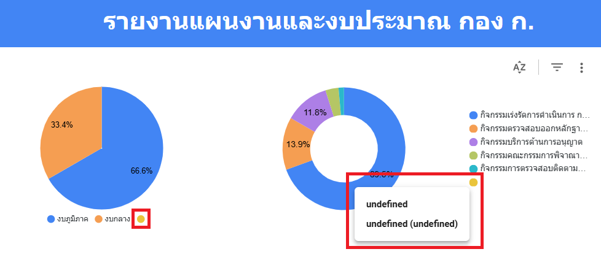
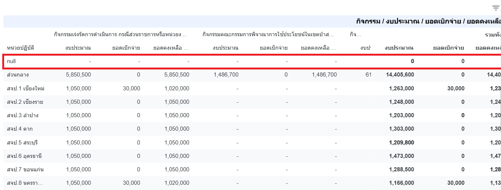
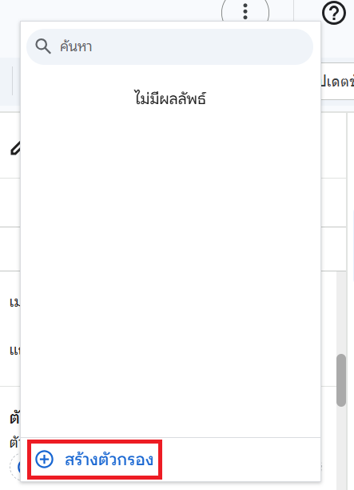
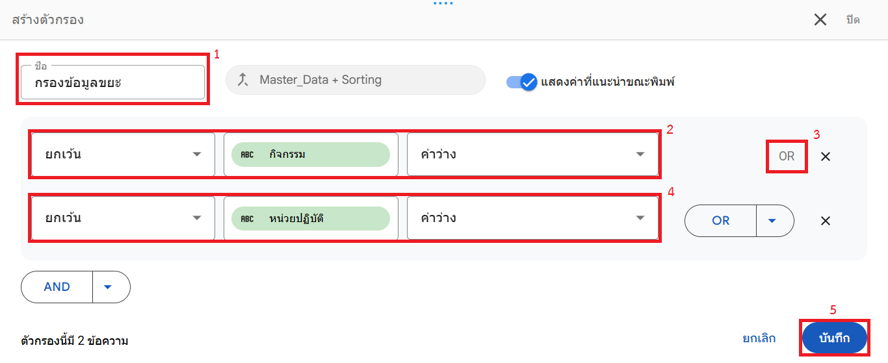

# Workshop เสริมที่ 4: เพิ่มความทนทานต่อข้อมูลแปลกปลอม

## สถานการณ์จำลอง

มีนักศึกษาจากวิทยาลัยแห่งหนึ่งเข้ามาฝึกงานในหน่วยงานของท่าน โดยหัวหน้าของท่านได้มอบหมายให้นักศึกษาฝึกงานรายดังกล่าวช่วยปรับปรุงข้อมูลงบประมาณในแผ่นงาน Google Sheets ที่ท่านใช้สร้างรายงานใน Looker Studio

เมื่อผ่านไปหนึ่งสัปดาห์ ท่านพบว่าแผนภูมิรูปวงกลมที่มีอยู่ มีคำอธิบายของส่วน "undefined" เพิ่มเข้ามา นอกจากนั้น ในตาราง Pivot ยังมีหน่วยปฏิบัติที่ชื่อ "null" ปรากฏขึ้นมา จึงเข้าไปตรวจสอบผ่านเมนู **ดูประวัติเวอร์ชัน** ในแผ่นงาน Google Sheet และพบว่านักศึกษาฝึกงานได้เพิ่มข้อมูลแปลกปลอมเข้ามาในเซลล์ O300 และ S300

{ width="600" }

{ width="600" }

{ width="800" }

ถึงแม้ข้อมูลแปลกปลอมจะถูกลบออก และหัวหน้าของท่านได้ว่ากล่าวตักเตือนนักศึกษาฝึกงานไปแล้ว แต่ท่านก็ตัดสินใจที่จะปรับปรุงรายงานใน Looker Studio ให้มีความทนทานต่อข้อมูลแปลกปลอมที่อาจถูกเพิ่มเข้ามาได้อีกในอนาคต โดยใช้กลไก **ตัวกรอง (filter)** ของ Looker Studio

## วัตถุประสงค์

1. เพื่อให้เข้าใจถึงปัญหารายงานแสดงผลผิดพลาดจากข้อมูลที่ไม่สมบูรณ์ (Dirty Data)
2. เพื่อให้สามารถใช้งานตัวกรอง (Filter) ในการคัดกรองข้อมูลที่ไม่ต้องการออกจากรายงานได้

## ทดลองเพิ่มข้อมูลแปลกปลอม

จำลองสถานการณ์โดยการจงใจเพิ่มข้อมูลแปลกปลอมเข้าไปใน Google Sheets เพื่อให้เห็นภาพปัญหาที่ชัดเจน

1. เปิดไฟล์ Google Sheets ที่เป็นแหล่งข้อมูลของท่าน
2. เลื่อนลงไปที่บรรทัดว่างด้านท้าย (เช่น บรรทัดที่ 300)
3. ในคอลัมน์ **ยอดคงเหลือ (GF)** (Column O) ให้พิมพ์คำว่า `aaa`
4. ในคอลัมน์ **ปีงบประมาณ** (Column S) ให้พิมพ์คำว่า `2569`

    { width="600" }

    !!! note "หมายเหตุ"
        หากท่านได้ทำตาม Workshop เสริมที่ 1 แล้ว รายงานจะแสดงผลเฉพาะข้อมูลที่มีปีงบประมาณถูกต้อง ดังนั้นจึงต้องเพิ่ม "2569" เข้าไปด้วย เพื่อให้เห็นปัญหาที่เกิดขึ้นได้ชัดเจน

5. กลับมาที่ Looker Studio และกดปุ่ม **รีเฟรชข้อมูล (Refresh data)**

    { width="600" }

6. สังเกตความผิดปกติที่เกิดขึ้นในแผนภูมิ เช่น มีชิ้นส่วน "undefined" ใน Pie Chart หรือมีแถว "null" ในตาราง

## การกรองข้อมูล (Filter)

ใช้ตัวกรองเพื่อตัดข้อมูลที่ไม่สมบูรณ์ออกไปจากรายงาน เพื่อให้รายงานแสดงผลเฉพาะข้อมูลที่ถูกต้องเท่านั้น

1. คลิกเลือกแผนภูมิที่ต้องการกรองข้อมูล (เช่น แผนภูมิวงกลม หรือ ตาราง Pivot)

    { width="600" }

2. ที่แถบ **การตั้งค่า (Setup)** ด้านขวามือ เลื่อนลงมาที่หัวข้อ **ตัวกรอง (Filter)**
3. คลิกปุ่ม **+ เพิ่มตัวกรอง (Add a filter)**
4. คลิกปุ่ม **สร้างตัวกรอง (CREATE A FILTER)** ที่ด้านล่างสุดของรายการ

    { width="400" }

5. ตั้งชื่อตัวกรองว่า `กรองข้อมูลขยะ` (หรือชื่อที่สื่อความหมาย)

    { width="800" }

6. กำหนดเงื่อนไขตัวกรองดังนี้:

    - **ยกเว้น (Exclude)** `กิจกรรม` **ค่าว่าง (Is blank)**
    - คลิก **OR**
    - **ยกเว้น (Exclude)** `หน่วยปฏิบัติ` **ค่าว่าง (Is blank)**

    *(ท่านสามารถปรับเปลี่ยนเงื่อนไขได้ตามลักษณะข้อมูลจริงที่พบ)*

7. คลิก **บันทึก (Save)**

เมื่อบันทึกแล้ว ข้อมูลที่มีปัญหาจะหายไปจากแผนภูมิ ท่านสามารถนำตัวกรองที่สร้างนี้ (`กรองข้อมูลขยะ`) ไปใช้กับแผนภูมิอื่นๆ ในหน้ารายงานได้ทันทีโดยไม่ต้องสร้างใหม่ เพียงแค่คลิก **เพิ่มตัวกรอง** แล้วเลือกชื่อตัวกรองที่สร้างไว้

{ width="800" }
